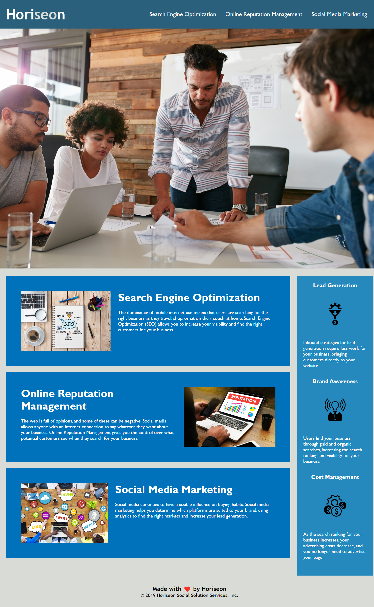

# Horiseon Refactor

## Purpose
This is an updated version of the Horiseon webpage that has been refactored to be more accessible, and to fix some broken links and update the code. The code was restructured to include semantic elements, and the CSS stylesheet was updated so it is now commented and arranged to follow the semantic structure. Finally the links that were broken are fixed, and all the images include "alt" attributes so they are more accessible. 

## Built with
* HTML
* CSS

## Website
https://samvrny.github.io/Horiseon-refactor-project/

Here is a look at the finished webpage!

 

## Contribution
Made by Samuel Varney 

### © 2019 Horiseon Social Solution Services, Inc.

